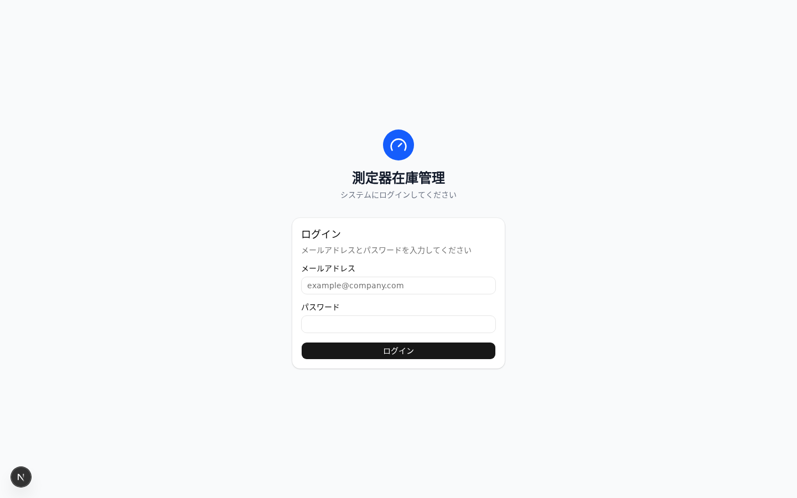
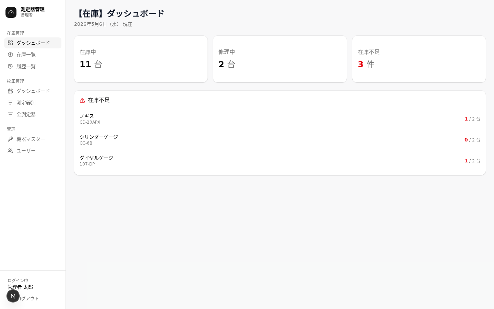
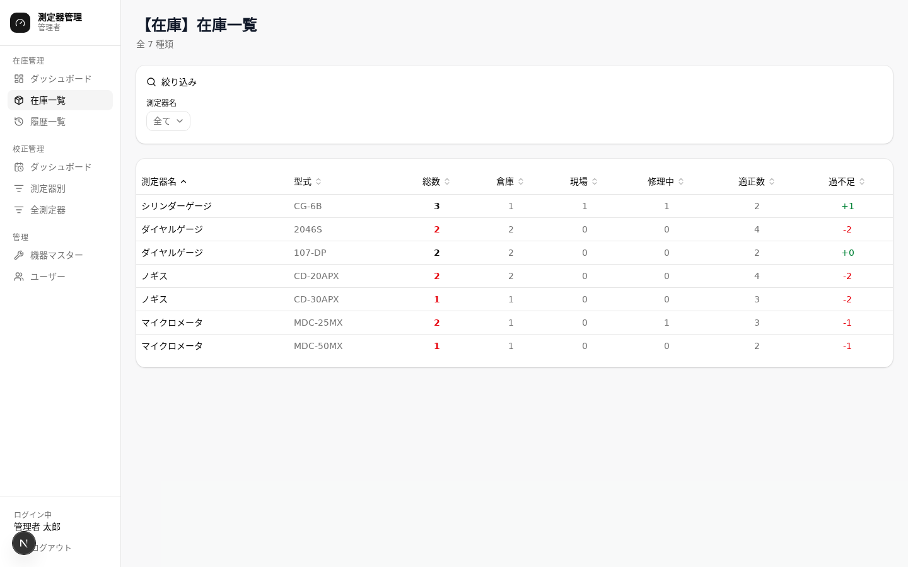
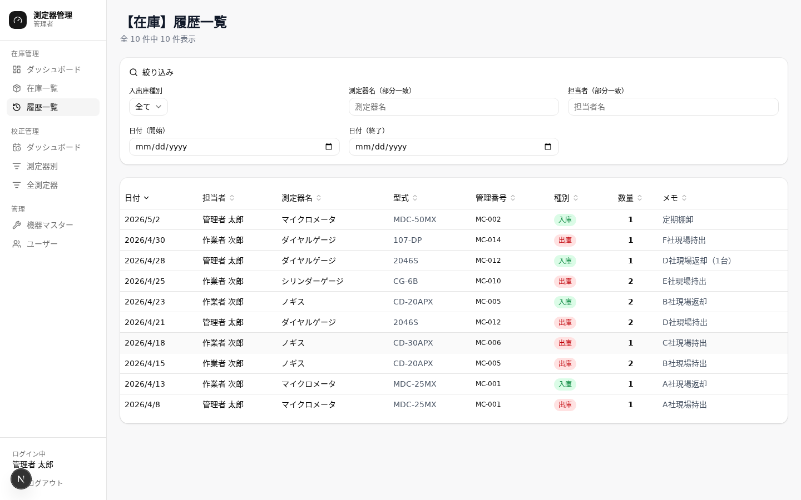
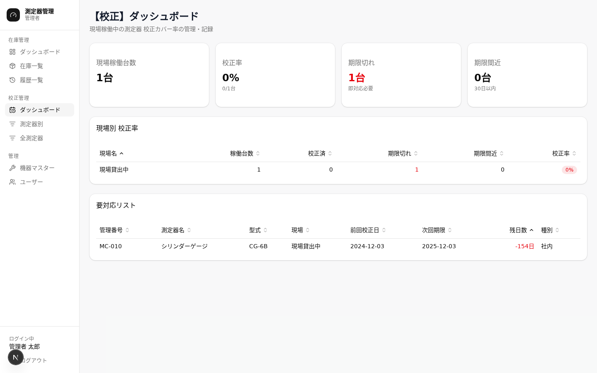
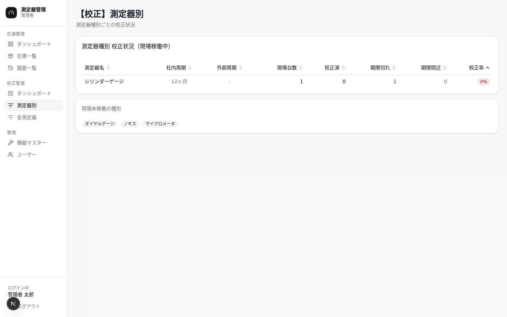
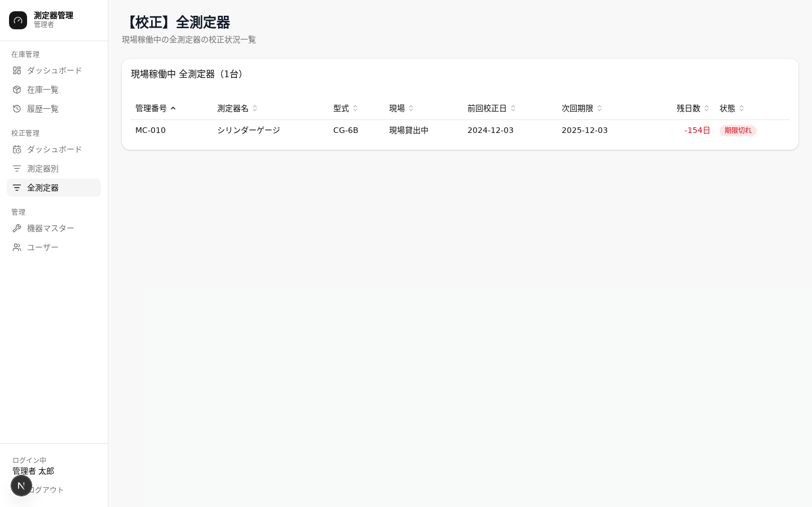
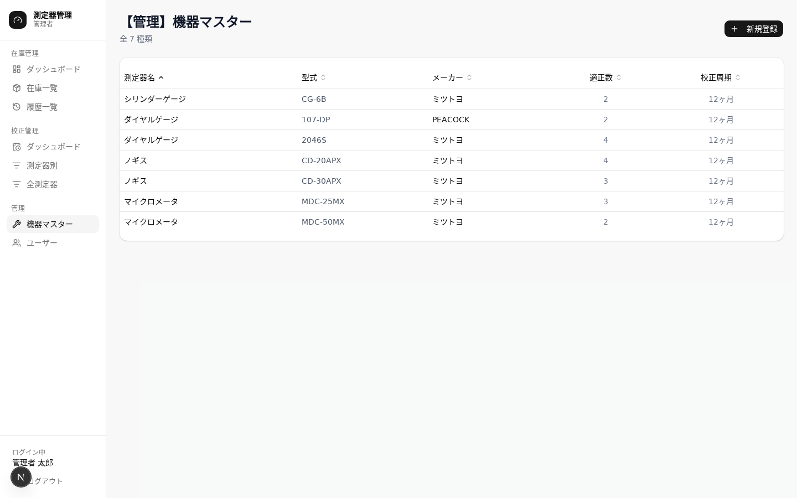
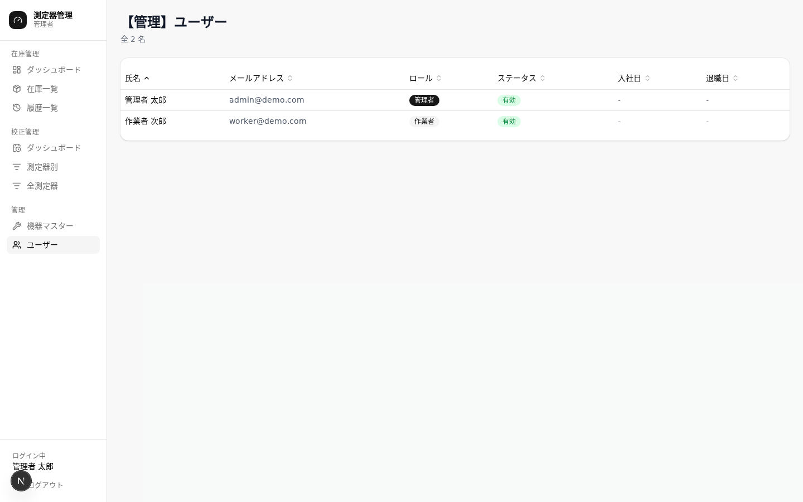

# 測定器在庫・校正管理システム 操作マニュアル

> 本記事は、当社が公開しているデモアプリ「測定器在庫・校正管理システム」の操作方法をご紹介するものです。製造現場で日々使われる**測定器の在庫**と**校正期限**を、1 つの画面でまとめて管理できることを目指して作りました。
> 専門知識がなくてもお読みいただけるよう、画面のスクリーンショットと一緒にステップごとに解説しています。実際の画面を触りながら読み進めていただくと、より分かりやすいかと思います。

---

## このシステムでできること

| 機能 | 解決したい困りごと |
|---|---|
| **測定器在庫管理** | 「どの測定器が今どこにあるのか分からない」「在庫が足りているのか把握できない」 |
| **校正管理** | 「校正の期限が近い測定器を見落としてしまう」「現場ごとの校正状況を一覧したい」 |

両方の機能は画面左のサイドバーから切り替えながら使います。アカウントの種類によって、見られる画面と操作できる範囲が変わります。

---

## 目次

1. [ログイン・ログアウト](#1-ログインログアウト)
2. [画面の基本的な見方](#2-画面の基本的な見方)
3. [在庫管理機能](#3-在庫管理機能)
   - [ダッシュボード](#31-ダッシュボード)
   - [在庫一覧と入出庫の記録](#32-在庫一覧と入出庫の記録)
   - [履歴一覧](#33-履歴一覧)
4. [校正管理機能](#4-校正管理機能)
   - [校正ダッシュボード](#41-校正ダッシュボード)
   - [測定器別の校正状況](#42-測定器別の校正状況)
   - [全測定器の一覧](#43-全測定器の一覧)
   - [校正記録を登録する](#44-校正記録を登録する)
5. [管理者向け機能](#5-管理者向け機能)
   - [測定器管理（機器マスター）](#51-測定器管理機器マスター)
   - [ユーザー管理](#52-ユーザー管理)
6. [困ったときは](#6-困ったときは)

---

## 1. ログイン・ログアウト

### ログイン



1. ブラウザでシステムの URL を開きます。
2. 表示されたログイン画面に、**メールアドレス**と**パスワード**を入力します。
3. **「ログイン」** ボタンを押すと、ダッシュボード（最初の画面）に進みます。

> **うまくログインできないとき**
> ・パスワードを間違えると「メールアドレスまたはパスワードが正しくありません」と表示されます。
> ・退職処理やアカウント停止が行われている場合はログインできません。社内の管理担当者にご相談ください。

### ログアウト

1. 画面左のサイドバー下部に表示されている **「ログアウト」** ボタンをクリックします。
2. ログイン画面に戻ります。

---

## 2. 画面の基本的な見方

### サイドバー（画面の左側）

画面の左端には、いつでも表示されている「サイドバー」があります。ここから各画面への移動やログアウトを行います。

```
[ 🔧 測定器管理        ]
   管理者
─────────────────────
在庫管理
  ダッシュボード
  在庫一覧
  履歴一覧

校正管理
  ダッシュボード
  測定器別
  全測定器

管理（管理者のみ）
  機器マスター
  ユーザー
─────────────────────
ログイン中
山田 太郎
  ログアウト
```

| 場所 | 役割 |
|---|---|
| **上部のブランドエリア** | システム名と自分のロール（管理者 / 作業者）が表示されます |
| **在庫管理セクション** | 在庫管理の各画面に移動できます |
| **校正管理セクション** | 校正管理の各画面に移動できます |
| **管理セクション** | 管理者アカウントのみ表示されます |
| **下部のフッター** | ログイン中のユーザー名とログアウトボタンがあります |

### 利用者の種類について

このシステムには 2 種類のアカウントがあります。

| 種類 | できること |
|---|---|
| **管理者** | すべての画面を使えます。「管理」セクションから機器マスターとユーザー管理も使えます。 |
| **作業者** | 在庫管理・校正管理の確認と入出庫操作ができます。「管理」セクションは表示されません。 |

> 本デモでは「管理者」アカウントでお試しいただいています。実際の運用では現場の作業者の方には「作業者」アカウントを発行する想定です。

---

## 3. 在庫管理機能

### 3.1 ダッシュボード



ログインすると最初に表示される画面です。倉庫全体の状況を一目で把握できるように、要点をカードでまとめています。

#### 上部の 3 枚のカード

| カード | 内容 |
|---|---|
| **在庫中** | 倉庫に置いてある測定器の台数 |
| **修理中** | 修理に出している測定器の台数 |
| **在庫不足** | 在庫数が適正数を下回っている件数（不足があると赤色で表示） |

#### 在庫不足のリスト

カードの下に、不足している測定器の一覧が並びます。測定器名・型式・現在の台数と適正数が分かるので、足りないものをすぐに発注・補充できます。

> 不足ゼロのときは「在庫不足の測定器はありません」とだけ表示されます。

---

### 3.2 在庫一覧と入出庫の記録



「どの種類の測定器が、どこに、何台あるか」を表で確認できる中心となる画面です。**入出庫の記録もこの画面から行います。**

#### 表の見方

| 列 | 内容 |
|---|---|
| 測定器名 | 測定器の名称（例：デジタルマルチメータ） |
| 型式 | メーカーの型番（例：FLUKE-87V） |
| 総数 | 廃棄済み以外の合計台数 |
| 倉庫 | 倉庫にある台数 |
| 現場 | 現場で使われている台数 |
| 修理中 | 修理に出している台数 |
| 適正数 | 用意しておきたい目標台数 |
| 過不足 | 総数から適正数を引いた数（マイナスは赤字） |

#### 絞り込みと並べ替え

- 画面上部の **「測定器名」のプルダウン** で、特定の測定器だけを表示できます（「全て」を選ぶと元に戻ります）。
- **表のヘッダー**（「総数」「倉庫」など）をクリックすると、その列の値で並べ替えできます。もう一度クリックすると逆順になります。

#### 個別の機器を確認・操作する

表の行をクリックすると、その測定器の **「個体一覧」** に進みます。個体一覧では 1 台ずつの所在（倉庫・現場名・修理中）と登録番号・シリアル No が見られます。

##### 所在を変更する（入出庫の記録）

このシステムでは、**「測定器の場所を変える」操作 = 入出庫の記録**になります。

1. 個体一覧画面で、動かしたい測定器の行をクリックします。
2. 「所在を変更」ダイアログが開きます。
3. 移動先（**倉庫 / 現場 / 修理中**）を選びます。
4. 「現場」を選んだ場合は、現場名の入力欄に移動先を入力します。
   - 入力欄の右端の ▼ をクリックすると、登録済みの現場名の一覧が表示されます。
   - 一覧から選択するか、新しい現場名を直接入力してください（新規入力すると現場マスターに自動登録されます）。
5. 必要に応じてメモと日付を入力します。
6. **「登録する」** ボタンを押せば完了です。

> **校正管理との連携**
> 現場へ出庫すると、校正管理側にも「次回校正予定日」が自動で作成されます。校正期限を別途登録する必要はありません。

##### 新しい個体を追加する

個体一覧画面の **「機器を追加」** ボタンから、同じ種類の測定器を増やすことができます。

| 項目 | 内容 |
|---|---|
| **初期所在** | 追加時の置き場所（倉庫 または 現場） |
| **現場名** | 初期所在を「現場」にした場合のみ表示されます |
| **登録番号** | 社内管理番号（必須） |
| **シリアルNo** | 製造シリアル番号（必須） |
| **日付** | 登録日 |
| **メモ** | 備考（任意） |

入力後「追加する」ボタンを押してください。

---

### 3.3 履歴一覧



過去の入出庫の記録を確認できる画面です。最新 500 件まで表示されます。

#### 表の見方

| 列 | 内容 |
|---|---|
| 日付 | 入出庫を行った日 |
| 担当者 | 操作した人の名前 |
| 測定器名 | 対象の測定器名 |
| 型式 | 対象の型番 |
| 管理番号 | 対象の個体管理番号 |
| 種別 | 入庫（緑のバッジ）または出庫（赤のバッジ） |
| 数量 | 動かした台数 |
| メモ | 登録時に書き残したメモ |

#### 絞り込み

画面上部の絞り込み欄で、必要な記録だけに絞れます。

| 項目 | 説明 |
|---|---|
| 種別 | 「入庫のみ」「出庫のみ」に絞り込み |
| 測定器名 | 名前の一部で検索 |
| 担当者 | 担当者名の一部で検索 |
| 開始日 / 終了日 | 期間を指定 |

「フィルタをクリア」を押すと、すべての絞り込みを解除して全件表示に戻ります。

---

## 4. 校正管理機能

校正管理では、現場で使われている測定器の **校正期限** を見守り、**校正を行ったときに記録を残す** ことができます。

サイドバーの **「校正管理」** セクションから、各画面に移動してください。

---

### 4.1 校正ダッシュボード



現場全体の校正状況をまとめてチェックできる画面です。

#### 上部の 4 枚のカード

| カード | 内容 |
|---|---|
| **現場稼働台数** | 今、現場に出ている測定器の合計台数 |
| **校正率** | 校正期限内の測定器の割合（80% を切ると赤くなります） |
| **期限切れ** | 校正期限を過ぎた台数（赤色） |
| **期限間近** | 30 日以内に期限を迎える台数（黄色） |

#### 現場別の校正率テーブル

現場ごとに、稼働台数・校正済み・期限切れ・期限間近・校正率が並びます。ヘッダーをクリックすれば任意の列で並べ替えできます。

#### 要対応リスト

期限が切れているもの、もしくは 30 日以内に期限を迎えるものが、対応すべき順番（赤 → 黄）で並びます。

| 列 | 内容 |
|---|---|
| 管理番号 | 個体ごとの番号 |
| 測定器名 | 測定器の名称 |
| 型式 | 型番 |
| 現場 | 設置場所 |
| 前回校正日 | 直近で校正を行った日 |
| 次回期限 | 次の校正期限 |
| 残日数 | 期限まで何日か（マイナスは期限切れ） |
| 種別 | 社内校正 / 外部校正 |

**行をクリックすると、その場で校正記録を登録できます**（[4.4 校正記録を登録する](#44-校正記録を登録する) を参照）。

---

### 4.2 測定器別の校正状況



「どの種類の測定器」がどのくらい校正できているか、種類ごとに集計した画面です。ヘッダーの **「測定器別」** から開きます。

#### 稼働中の測定器テーブル

| 列 | 内容 |
|---|---|
| 測定器名 | 種類の名称 |
| 社内周期 | 社内で校正を行う間隔（〇ヶ月ごと） |
| 外部周期 | 外部業者による校正の間隔（「なし」の場合は外部校正は不要） |
| 現場台数 | 現場に出ている台数 |
| 校正済 | 期限内に校正できている台数 |
| 期限切れ | 校正期限を過ぎた台数 |
| 期限間近 | 30 日以内に期限を迎える台数 |
| 校正率 | 校正済み ÷ 現場台数（バッジの色で状況を表示） |

#### バッジの色の意味

| 色 | 意味 |
|---|---|
| 青 | 校正率 100%（とても良い状態） |
| グレー | 校正率 80% 〜 99% |
| 赤 | 校正率 80% 未満（要注意） |

画面の下のほうには、現在現場に出ていない測定器の種類もバッジで表示されます。

---

### 4.3 全測定器の一覧



現場に出ているすべての測定器を、1 台ずつ一覧で見られる画面です。ヘッダーの **「全測定器」** から開きます。

#### 表の見方

| 列 | 内容 |
|---|---|
| 管理番号 | 個体識別番号 |
| 測定器名 | 種類の名称 |
| 型式 | 型番 |
| 現場 | 設置場所 |
| 前回校正日 | 最後に校正した日（記録がない場合は「未記録」） |
| 次回期限 | 次の校正期限 |
| 残日数 | 期限まで何日か |
| 状態 | バッジで校正状態を表示 |

#### 状態バッジの意味

| バッジ | 説明 |
|---|---|
| **期限切れ**（赤） | 校正期限を過ぎています。早めの対応が必要です。校正記録が一度もない場合もこの状態で表示されます |
| **期限間近**（黄） | 30 日以内に期限を迎えます |
| **正常**（グレー） | 校正は期限内です |

**こちらも行をクリックすると、その場で校正記録を登録できます。**

---

### 4.4 校正記録を登録する

校正ダッシュボードの「要対応リスト」、または「全測定器」画面の行をクリックすると、校正記録を登録するダイアログ（小さな入力ウィンドウ）が開きます。

#### 登録の手順

1. 対象の測定器の行をクリックします。
   → クリックした測定器が自動的に選ばれた状態でダイアログが開きます。
2. 選ばれている測定器が正しいか確認します（違っていれば検索欄から管理番号や測定器名で選び直せます）。
3. **校正実施日** を入力します。
4. **次回校正期限** が自動で計算されて表示されます。
   → 校正実施日 + 測定器の種類ごとに決められた校正周期で算出されます。
5. **校正結果**（合格 / 不合格）を選びます。
6. 必要なら **備考** にメモを書き残します。
7. **「登録する」** ボタンを押して完了です。

> **校正周期の変更について**
> 「次回校正期限」のもとになる校正周期は、後述の **「機器マスター」画面**（サイドバーの「管理」セクションから開きます）から測定器の種類ごとに変更できます。

---

## 5. 管理者向け機能

ここから先は **管理者アカウント** でのみ利用できる機能です。
サイドバーの **「管理」** セクションに「機器マスター」と「ユーザー」のリンクが表示されます。

---

### 5.1 測定器管理（機器マスター）



サイドバーの「管理」セクションから **「機器マスター」** を選ぶと、この画面が開きます。
測定器の種類（測定器名・型式の組み合わせ）を管理する画面です。新しい種類を登録したり、適正数や校正周期を変更したりできます。

> 個体（1 台ずつ）の追加は、在庫一覧 → 個体一覧画面の「機器を追加」から行います。

#### 一覧の見方

| 列 | 内容 |
|---|---|
| 測定器名 | 測定器の種類の名称 |
| 型式 | 型番 |
| メーカー | 製造メーカー名 |
| 適正数 | 在庫として持っておきたい目標台数 |
| 校正周期 | 社内校正を行う間隔（〇ヶ月） |

#### 新しい種類を登録する

1. 「新規登録」ボタンを押します。
2. 以下の項目を入力します。

| 項目 | 必須 | 説明 |
|---|---|---|
| 測定器名 | ○ | プルダウンから既存の名称を選びます（未登録の場合は管理者に相談） |
| 型式 | − | 既存の型番を選ぶか、新しい型番を入力します（新しい場合は自動で型式マスターに登録されます） |
| メーカー | − | 製造メーカー名 |
| 適正数 | − | 在庫として持っておきたい目標台数（初期値：1） |
| 校正周期（ヶ月） | − | 社内校正を行う間隔（初期値：12） |

3. 「保存する」ボタンを押せば完了です。

#### 登録済みの内容を編集する

一覧の行をクリックすると編集ダイアログが開き、適正数と校正周期を変更できます。
※ 測定器名・型式・メーカーは登録後に変更できません。

#### 削除する

編集ダイアログの **「この機器を削除する」** ボタンから、その種類の測定器を管理対象から除外できます。
削除された測定器は在庫一覧や校正管理の対象から外れます。

> **ご注意**
> 削除処理は元に戻せません。誤って削除してしまった場合は、再度登録し直していただくことになります。

---

### 5.2 ユーザー管理



システムを使うユーザー（社員アカウント）を管理する画面です。**管理者のみ** がアクセスできます（作業者の方がアドレスバーに直接 URL を入れても、ダッシュボードに戻されます）。

#### 一覧の見方

| 列 | 内容 |
|---|---|
| 氏名 | ユーザーの名前 |
| メールアドレス | ログインに使うアドレス |
| ロール | 管理者 または 作業者 |
| ステータス | 有効 / 無効 / 退職済 |
| 入社日 | 任意の入力項目 |
| 退職日 | 設定すると、その日からログインできなくなります |

#### ステータスの意味

| ステータス | 表示色 | ログインの可否 |
|---|---|---|
| **有効** | 緑 | 可能 |
| **無効** | 赤 | 不可（管理者が手動で停止した状態） |
| **退職済** | グレー | 不可（退職日を過ぎると自動でこの状態になります） |

#### 新しいユーザーを追加する

> **デモ環境でのご注意**
> 公開デモでは安全のため、新規ユーザーの追加・編集・削除はできない設定にしています。
> 実際にご導入いただく際は、以下の手順でユーザーを追加できます。

1. 「新規追加」ボタンを押します。
2. 以下の項目を入力します。

| 項目 | 必須 | 説明 |
|---|---|---|
| 氏名 | ○ | 名前（フルネーム） |
| メールアドレス | ○ | ログインに使うアドレス |
| 仮パスワード | ○ | 初回ログイン用（6 文字以上） |
| ロール | ○ | 管理者 / 作業者 |
| アカウント状態 | − | 初期値は「有効」 |
| 入社日 / 退職日 | − | 任意 |

3. 「追加する」を押すと登録完了です。
   → 追加後、ご本人にメールアドレスと仮パスワードをお伝えください。

#### ユーザー情報を編集する

一覧の行をクリックすると編集ダイアログが開きます。
パスワード以外の項目は後からいつでも変更できます。

#### ユーザーを削除する

編集ダイアログの「削除する」ボタンから削除できます。

> **ご注意**
> 入出庫の操作履歴があるユーザーは、履歴を残すために削除できない仕組みになっています。
> その場合は「無効」ステータスに変更して、実質的にログインできない状態にしてください。

---

## 6. 困ったときは

### ログインできない

- メールアドレスとパスワードが正しいかご確認ください。
- パスワードを忘れた場合は、社内の管理者に連絡してリセットしてもらってください。
- 「アカウントが無効です」と表示される場合も、管理者にご相談ください。

### 在庫数がおかしい

- 「履歴一覧」画面で、直近の入出庫の記録を確認してみてください。
- 誤った入出庫があった場合は、逆方向の操作（入庫したなら出庫）で修正してください。記録は残ります。

### 校正期限の計算が想定と違う

- 校正周期の設定は **「機器マスター」画面**（サイドバーの「管理」セクションから開きます）から変更できます。
- 測定器の種類ごとに別々の周期を設定できます。

### 測定器が一覧や選択肢に出てこない

- 削除済みの測定器は各画面の対象から外れています。
- そもそも登録されていない可能性もあります。「機器マスター」画面で、名称・型式が登録されているかをご確認ください。

### 操作を間違えた

- 入出庫の記録は取り消せません。逆方向の操作で打ち消してください。
- 削除処理は取り消せません。誤って削除した場合は、再度登録し直してください。

---

*本マニュアルは、当社デモアプリ「測定器在庫・校正管理システム」の操作説明としてご用意しています。*
*ご質問・導入のご相談は、当社サイトのお問い合わせフォームよりお気軽にお寄せください。*
